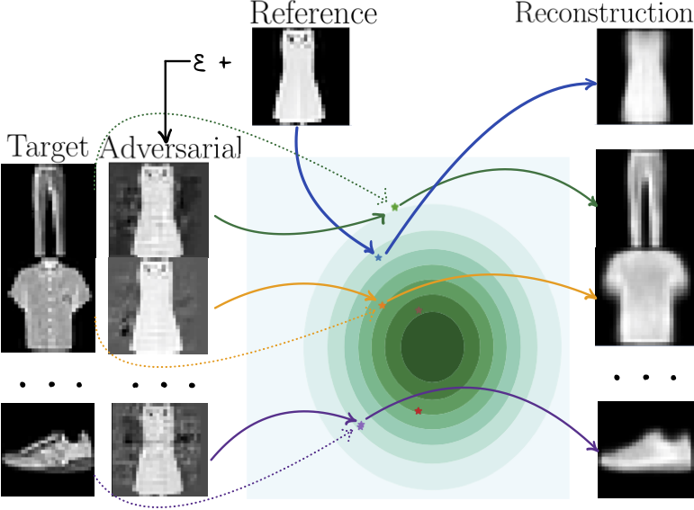

# Diagnosing Vulnerability of Variational Auto-Encoders to Adversarial Attacks

This repository contains the source code from the paper:

[Diagnosing Vulnerability of Variational Auto-Encoders to Adversarial Attacks](https://arxiv.org/abs/2103.06701) 
<br/>**[Anna Kuzina](https://akuzina.github.io/), [Max Welling](https://staff.fnwi.uva.nl/m.welling/), [Jakub M. Tomczak](https://jmtomczak.github.io/)**.
#### Abstract
*In this work, we explore adversarial attacks on the Variational Autoencoders (VAE). We show how to modify data point to obtain a prescribed latent code (supervised attack) or just get a drastically different code (unsupervised attack). We examine the influence of model modifications ($\beta$-VAE, NVAE) on the robustness of VAEs and suggest metrics to quantify it.*



Below we provide examples of adversarial attacks on NVAE. 
The first column depicts target images, then we plot adversarial inputs  (on the left, with yellow background) and its reconstructions (on the right). 
<table><tr>
<td>  </td>
<td>  </td>
<td>  </td>
<td>  </td>
</tr></table>

### Reproduce

#### Dependencies
In order to reproduce our results, please first install the required dependencies. This can be done by:
```
conda env create -f conda_requirements.yaml
```
This will create the conda environment `adv_vae` with the correct dependencies.

#### Experiments 
Parameters which can be specified via the `argsparser` can be found in the corresponding `config.py` file.

We use [wandb](https://wandb.ai) to track the experiments. Specify you API key and user name in th files `run_experiments.py`, `run_attack.py` and `utils/wandb.py` before running the experiments below.  

1. Train VAE
```
bash runs/train_mnist.sh
```
2.1. Run supervised attack
```
bash runs/attack_mnist.sh
```
2.2. Run unsupervised attack
```
bash runs/attack_mnist_uns.sh
```

### Cite
If you found this work useful in your research, please consider citing:
```
@article{kuzina2021diagnosing,
	title={Diagnosing Vulnerability of Variational Auto-Encoders to Adversarial Attacks},
	author={Kuzina, Anna and Welling, Max and Tomczak, Jakub M},
	year={2021},
    journal={RobustML Workshop@ICLR 2021},
}
```

### Acknowledgements
*This research was (partially) funded by the Hybrid Intelligence Center, a 10-year programme  funded by the Dutch Ministry of Education, Culture and Science through the Netherlands  Organisation for Scientific Research, https://hybrid-intelligence-centre.nl.*
